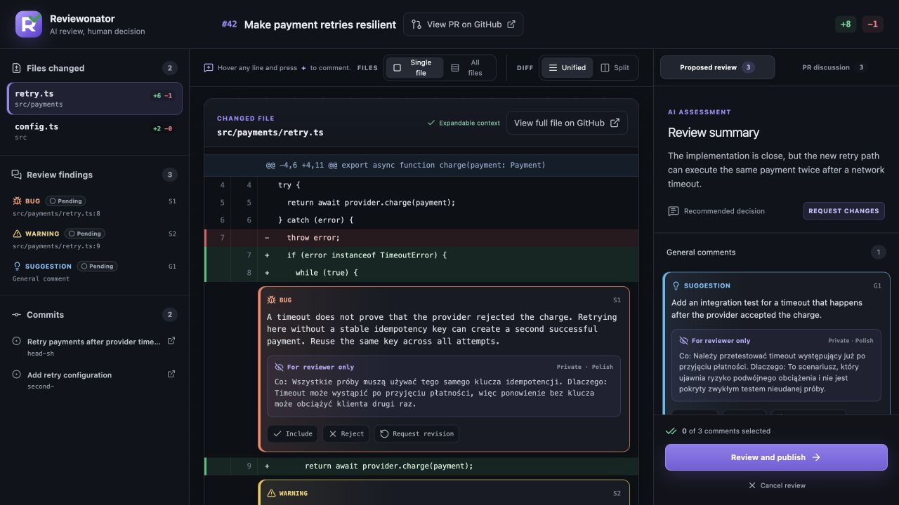

<div align="center">
  
  <h1>Reviewonator</h1>
  <p><strong>AI review, human decision.</strong></p>

  [](https://github.com/johniak/reviewonator/actions/workflows/ci.yml)
  [](https://github.com/johniak/reviewonator/releases)
  [](LICENSE)
</div>

Reviewonator turns an AI-generated pull request review into a focused, local review workspace. Inspect every finding in its diff context, revise the proposed wording, choose what to include, and publish only after an explicit confirmation.

Reviewonator supports Claude Code and Codex through one shared review workflow.

<p align="center">
  
</p>

See the [feature guide](docs/features.md) for a visual walkthrough of the review workspace, comment decisions, pull request discussion, and safe publishing flow.

## Why Reviewonator?

- Review findings appear next to the exact changed lines, with clearly visible severity levels.
- Read existing conversation comments, submitted reviews, and inline review comments without leaving the diff workspace.
- Browse one file at a time or scroll through all changed files.
- Switch between unified and side-by-side diffs.
- Expand context beyond the patch without exposing a GitHub token to the browser.
- Keep private reviewer explanations separate from comments sent to the pull request.
- Edit, include, or exclude each inline and general comment. Nothing is included by default.
- Preview the complete GitHub review before choosing **Comment**, **Approve**, or **Request changes**.
- Cancel safely: Reviewonator never publishes automatically.

## How it works

1. The installed Claude Code or Codex skill performs a pull request review and writes a validated JSON document.
2. The `reviewonator` executable retrieves pull request data through your authenticated GitHub CLI session.
3. A local loopback-only web application opens in your browser.
4. You inspect and edit the proposed review.
5. Reviewonator publishes only the selected content after an explicit confirmation.

Your GitHub credentials remain in the CLI process. They are never embedded in the page or written to the review JSON.

## Requirements

- macOS or Linux on x64 or ARM64
- [GitHub CLI](https://cli.github.com/) installed and authenticated with `gh auth login`
- [Claude Code](https://docs.anthropic.com/en/docs/claude-code/overview), Codex, or both
- Access to the pull request you want to review

[Bun](https://bun.sh/) is required only when building from source.

## Install

Clone the repository and run the installer:

```sh
gh repo clone johniak/reviewonator
cd reviewonator
./scripts/install.sh
```

The installer first requires an explicit multi-select choice for Claude Code, Codex, or both. It never chooses an agent integration silently. It then asks which language the agent should use for comments published to GitHub and for private reviewer notes. Both language choices default to English.

When a local build is not present, the installer downloads the latest binary for your platform from GitHub Releases. It installs:

- the executable in `~/.local/bin/reviewonator`;
- the Claude Code skill in `~/.claude/skills/reviewonator`, when selected;
- the Codex skill in `~/.agents/skills/reviewonator`, when selected.

Make sure `~/.local/bin` is on your `PATH`. Custom locations are supported:

```sh
./scripts/install.sh \
  --targets claude,codex \
  --bin-dir "$HOME/bin" \
  --claude-skill-dir "$HOME/.claude/skills" \
  --codex-skill-dir "$HOME/.agents/skills" \
  --comment-language English \
  --reviewer-language English
```

`--targets` accepts `claude`, `codex`, or a comma-separated selection. Non-interactive installation must provide `--targets` or `REVIEWONATOR_TARGETS`; the installer never guesses. `REVIEWONATOR_COMMENT_LANGUAGE` and `REVIEWONATOR_REVIEWER_LANGUAGE` provide the remaining non-interactive configuration. The older `--skill-dir` option remains an alias for `--claude-skill-dir` and does not implicitly select Claude Code.

To install from a source checkout instead:

```sh
bun install --frozen-lockfile
bun run build
./scripts/install.sh --local
```

The installer and uninstaller use ownership markers and refuse to overwrite or remove files they do not manage.

### Codex and GitHub authentication

On macOS, Codex's sandbox may be unable to read the GitHub CLI token stored in Keychain even though `gh auth status` succeeds in your normal terminal. The Reviewonator skill handles this by requesting permission to run authenticated `gh` commands and the Reviewonator process outside the sandbox. Approve only the narrowly scoped commands shown by Codex. This permission lets the process use your existing `gh` login; it does not publish a review. Publication still requires separate, explicit confirmation in the Reviewonator UI.

Do not work around the sandbox by copying the GitHub token into a prompt, configuration file, `GH_TOKEN`, or `GITHUB_TOKEN`.

## Use

Invoke the installed skill with a pull request URL.

In Claude Code:

```text
/reviewonator https://github.com/owner/repository/pull/123
```

In Codex:

```text
$reviewonator https://github.com/owner/repository/pull/123
```

The agent completes the review first, then launches Reviewonator. In the application:

1. Read the private reviewer explanation for each finding.
2. Edit the public comment if needed.
3. Select only the findings you want to publish.
4. Add an optional general comment.
5. Open the publish preview and choose the GitHub review event.
6. Confirm the exact payload.

An approval may be submitted without a summary. Requesting changes requires at least one selected comment or a non-empty summary, matching the intent of that review event.

## Update and uninstall

Run the installer again to check GitHub Releases and update an older managed installation:

```sh
./scripts/install.sh
```

The installer reports the installed and latest versions, skips the download when already current, preserves the existing language choices, and refuses to downgrade a newer build. Use `--force` only when you intentionally want to reinstall or downgrade to the latest release. Use `--local` to install the executable and skill from the current source checkout instead of GitHub Releases.

Check the installed version with:

```sh
reviewonator --version
```

Run the uninstaller and select one or both agent integrations to remove:

```sh
./scripts/uninstall.sh
```

The same `--targets`, `--bin-dir`, `--claude-skill-dir`, and `--codex-skill-dir` options are available when uninstalling. The executable remains installed while another managed integration still uses it.

## Development

```sh
bun install --frozen-lockfile
bun run dev -- https://github.com/owner/repository/pull/123 --review-file path/to/review.json
```

Useful commands:

```sh
bun run typecheck   # TypeScript validation
bun run test        # Production web build and full test suite
bun run build       # Single-file web app and native executable
bun run check       # Typecheck, tests, and production build
```

Tests exercise domain validation, GitHub integration boundaries, the HTTP server, browser behavior, the CLI, installation, and release packaging. Please do not replace real behavior with mocks unless an integration cannot be exercised practically.

## Release process

1. Update the version in `package.json`.
2. Ensure `bun run check` passes.
3. Create and push a tag such as `v0.1.0`.

The release workflow builds binaries for macOS and Linux on x64 and ARM64, packages the skill and license notices, creates SHA-256 checksums, and publishes a GitHub Release.

## Project status

Reviewonator is an early-stage project. Its review workflow and JSON contract may evolve before version 1.0. Claude Code and Codex are supported today.

## Contributing and security

Contributions are welcome. Read [CONTRIBUTING.md](CONTRIBUTING.md) and the [Code of Conduct](CODE_OF_CONDUCT.md) before opening a pull request.

Please report vulnerabilities privately according to [SECURITY.md](SECURITY.md), not through a public issue.

## License

Reviewonator is available under the [MIT License](LICENSE). Third-party attribution is documented in [THIRD_PARTY_NOTICES.md](THIRD_PARTY_NOTICES.md).
