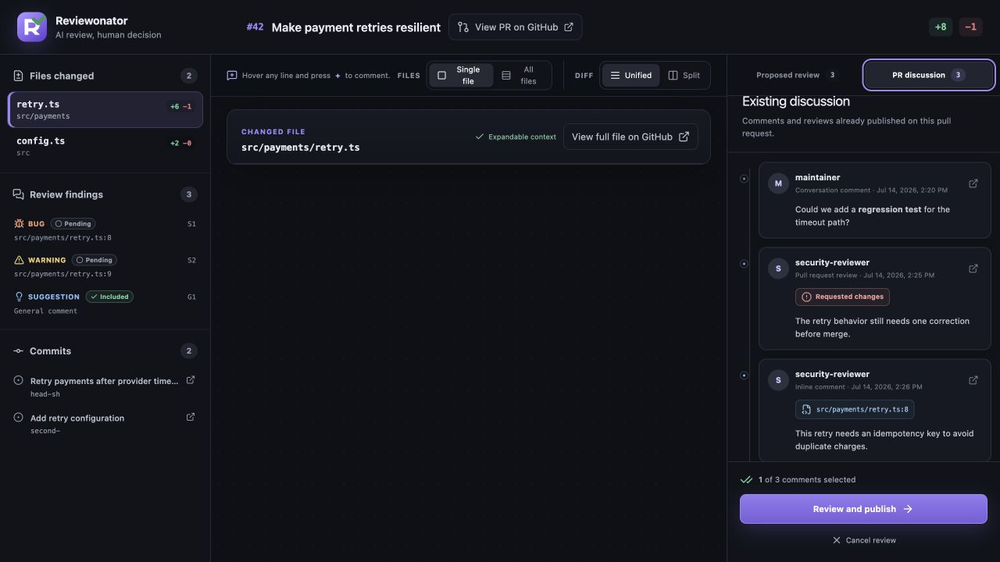
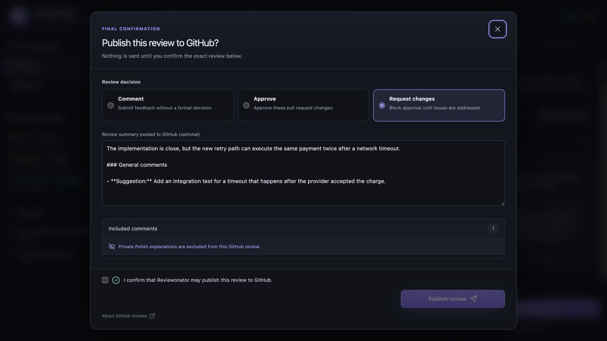

# Feature guide

Reviewonator is a local, human-in-the-loop workspace for pull request reviews created by an AI agent. The agent investigates the change and proposes findings; you decide what, if anything, reaches GitHub.

## Review the change in context

The workspace keeps the pull request, changed files, findings, and commits in one place. Each inline finding opens the relevant file and line. Severity borders and labels make bugs, warnings, suggestions, security issues, and nits easy to distinguish.

You can:

- review one file at a time or scroll through every changed file;
- switch between unified and side-by-side diffs;
- expand ten lines of context above or below a patch;
- open the complete file or pull request on GitHub;
- navigate directly between findings from the left sidebar;
- add your own note to any diff line for the AI agent to verify and rewrite.

Context expansion is handled by the local Reviewonator process through your authenticated GitHub CLI session. GitHub credentials are never sent to the browser.

## Decide what happens to every finding

Nothing is included by default. Every proposed comment has an explicit state:

- **Pending** — no decision has been made;
- **Included** — it will appear in the publication preview;
- **Revision requested** — your note is returned to the AI agent for another pass;
- **Rejected** — you consciously chose not to publish it.

These decisions persist when the AI agent returns a revised review, so accepted work is not lost. Public GitHub wording stays separate from the private reviewer note. The private note explains the issue in the configured reviewer language and is never published.

## Read the existing pull request discussion

The **PR discussion** tab brings the conversation already on GitHub into the workspace. It includes conversation comments, submitted reviews, and inline review comments, with direct links back to their GitHub locations.

## Preview and publish deliberately

The final dialog shows the exact review that Reviewonator is prepared to send. You can choose the GitHub event — **Comment**, **Approve**, or **Request changes** — and inspect the selected comments in a scrollable list. The review summary is optional, including for approvals.

Publication requires a separate confirmation checkbox. Closing the dialog or cancelling the review publishes nothing.

## Use the same workflow with Claude Code or Codex

The installer can target Claude Code, Codex, or both. It also configures the language used for public comments and the separate language used for private reviewer notes; both default to English. The review schema and human confirmation flow remain the same across supported agents.
